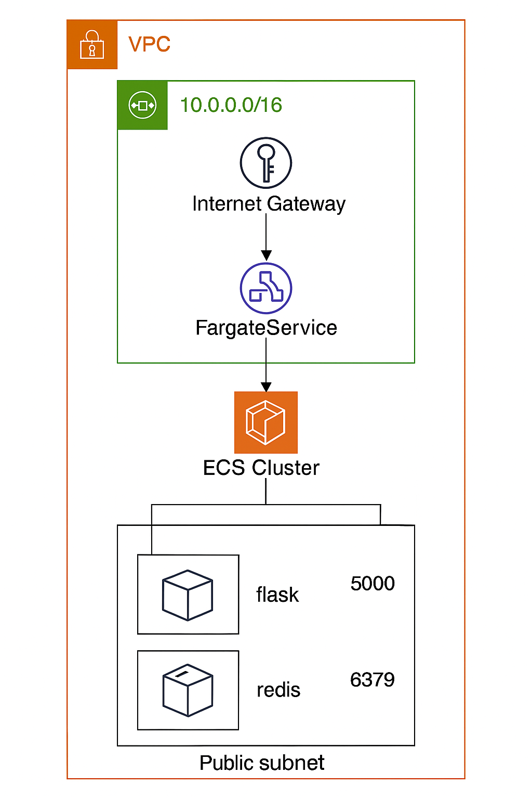
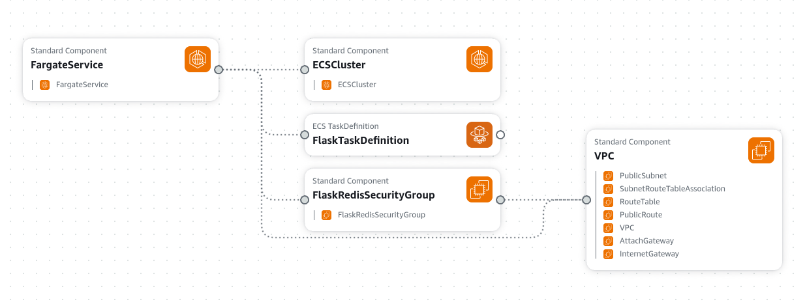

# AWSCloudFormationFargate2Tasks

This project uses AWS CloudFormation to define infrastructure for an ECS Fargate service running two tasks: a Flask web server and a Redis container.

Uses docker images created and uploaded to Fargate in https://github.com/mnokka/FlaskRedis_AWS_Fargate_TwoTasks

What It Creates

1) VPC with internet access
2) Public Subnet + Route Table
3) Internet Gateway
4) ECS Cluster
5) IAM Role for ECS task execution
6) ECS Fargate Service with 2 containers: Flask + Redis

You might need to add extra rights for the used IAM user

### Check used user rights:
 
*aws iam list-attached-user-policies --user-name <USERACCOUNT>*

### Create the stack:

 *aws cloudformation create-stack --stack-name fargate-base  --template-body file://fargate-stack.yml   --capabilities CAPABILITY_NAMED_IAM*

### Check creation progress:

*aws cloudformation describe-stack-events --stack-name fargate-base*

### Deploy / update stack:

Can be used instead create-stack for updates

*aws cloudformation deploy --template-file fargate-stack.yml --stack-name fargate-base --capabilities CAPABILITY_NAMED_IAM*

### Get more service and task info:

*aws ecs list-services --cluster FlaskRedisCluster*
*aws ecs list-tasks --cluster FlaskRedisCluster*

### Stop all tasks (to avoid billing):

*aws ecs update-service --cluster FlaskRedisCluster --service <SERVICE-NAME> --desired-count 0*

Replace <SERVICE-NAME> with the actual service name, e.g.: fargate-base-FargateService-bFGc1jDrTTsR
You can get the name from aws ecs list-services.

### Clean up and removal:

Remove whole insfrastructure

*aws cloudformation delete-stack --stack-name fargate-base*

## TODOS

* Add output values (e.g. Public IP of Flask)

* Add log group for container logging

* Add health checks

### Security & Considerations

This stack is intended for testing/development use. For production, consider the following:

1. Security Group

    Flask port (5000) is open to the entire internet (0.0.0.0/0). Restrict access or use HTTPS with a Load Balancer.

    Redis port (6379) is restricted to internal traffic (10.0.0.0/16).

2. IAM Roles

    Avoid over-permissioning 

3. Docker Image

    Uses :latest tag for the image. Use version tagged image

4. Cost Awareness

    *Fargate tasks incur costs while running*

    Set desired count to 0 when not in use to avoid unnecessary charges.

5. Best Practices

    Enable CloudTrail and CloudWatch for logs and monitoring.

    Use VPC Flow Logs for network visibility.

